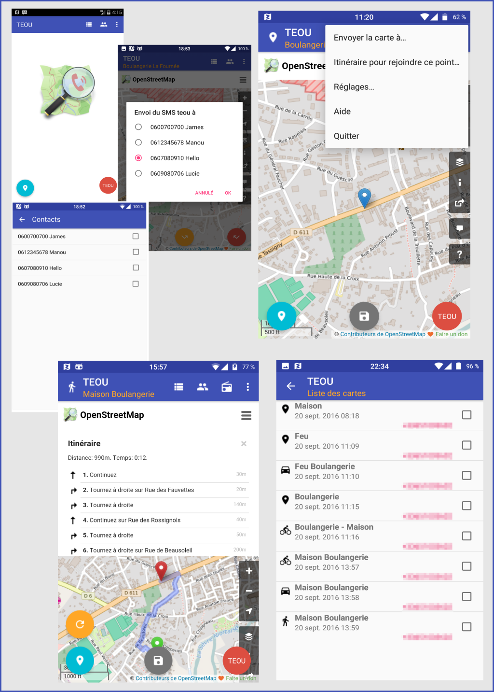

# Bienvenue dans l'application TEOU

Une application toute simple qui va vous permettre de visualiser votre position ou la position de votre contact sur une carte OpenStreetMap.

## Son principe

Pour connaître la position de votre contact, 
l'application va émettre un `SMS teou` vers le n° de téléphone de votre contact 
que vous aurez préalablement saisi dans l'application'.

Si votre contact a lui aussi installé l'application TEOU sur son smartphone ANDROID,
l'application va réagir au SMS et vous répondra en transmettant la position de son appareil.

A la réception de la réponse, la position de l'appareil de votre contact sera affichée sur la carte.
L'application utilise le portail `OpenStreetMap` pour afficher la carte el la position.
La réponse au `SMS teou` sera de la forme 
``
SUILA http://www.openstreetmap.org/?mlat=<latitude>&mlon=<longitudue>&zoom=16#map=16/<latitude>/<longitudue> 
``
Chaque position est historisée dans l'espace de stockage du smartphone qui réceptionne la position.

## Pour commencer

## Les écrans de l’application

## Avertissements

Pour bénéficier de toutes les fonctionnalités, il faudra autoriser l'application :

- Contacts
- Position
- SMS
- Stockage
- Téléphone

_Pour pouvoir réagir à la réception de SMS sur l’appareil, 
l’application sera toujours active. 
Une icône dans la barre de notification de l’appareil permet à tous moments d'afficher l’application en avant plan et de l'arrêter via le menu **Quitter**'._

Dès que vous aurez démarré l'application TEOU sur votre smartphone 
toute personne **déclarée dans vos contacts** pourra connaître votre position en vous envoyant simplement un SMS avec comme contenu `teou`.

L'application va réagir à ce SMS et renvoyer votre position dans un SMS sous la forme

``
SUILA SUILA http://www.openstreetmap.org/?mlat=46.3844553&mlon=-0.2544898&zoom=16#map=16/46.3844553/-0.2544898
``

Il suffira alors au demandeur de cliquer sur le lien pour visualiser la position dans le navigateur internet.

En résumé, pour connaître votre position, il n'est pas nécessaire d'avoir installé TEOU sur son smartphone ANDROID, IOS ou WINDOWS.

Les SMS de personnes non déclarées dans la liste des contacts autorisés ne seront pas traités.

.
